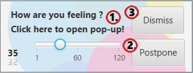
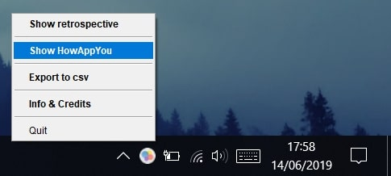

# HowAppYou

## Index

1. [**What is HowAppYou?**](#what-is-howappyou)
2. [**System Requirements**](#system-requirements)
3. [**User Guide**](#user-guide)
4. [**Credits**](#credits)

<ol>
<li>

## What is HowAppYou?

HowAppYou is an app developed to gather daily feedback on the emotional state of some subjects while they are working.
The main aim of the app is gather enought data to be used later for the developement of an AI.

</li>
<li>

## System Requirements

	CPU: Pentium 2 at 266 MHz or newer
	DISCK: 124 MB for JRE, 2 MB for Java Update
	RAM: 200 MB for the app
	OS: with GUI and Tray support
	
		Windows 10 (8u51 and newer)
		Windows 8.x (Desktop)
		Windows 7 SP1
		Windows Vista SP2
		Windows Server 2008 R2 SP1 (a 64 bit)
		Windows Server 2012 e 2012 R2 (a 64 bit)
	
		Mac OS X 10.8.3+, 10.9+
	
		Oracle Linux 5.5+1
		Oracle Linux 6.x (a 32 bit), 6.x (a 64 bit)2
		Oracle Linux 7.x (a 64 bit)2 (8u20 and newer)
		Red Hat Enterprise Linux 5.5+1, 6.x (a 32 bit), 6.x (a 64 bit)2
		Red Hat Enterprise Linux 7.x (a 64 bit)2 (8u20 and newer)
		Suse Linux Enterprise Server 10 SP2+, 11.x
		Suse Linux Enterprise Server 12.x (a 64 bit)2 (8u31 and newer)
		Ubuntu Linux 12.04 LTS, 13.x
		Ubuntu Linux 14.x (8u25 and newer)
		Ubuntu Linux 15.04 (8u45 and newer)
		Ubuntu Linux 15.10 (8u65 and newer)
	
Download [**JAVAx64**](https://www.java.com/it/download/windows-64bit.jsp)
or Download [**JAVAx86**](https://www.java.com/it/download/)

</li>
<li>

## User Guide
	
Il software HowAppYou è basato sull'utilizzo di due principali finestre: la Notifica (Notification) e la finestra questionatio (HowAppYou Window).
All'avvio dell'applicazione mediante il doppio click del file "HowAppYou.jar" è possibile visualizzare a video la notifica dell'applicazione;

### -(Notification)-

Da tale notifica è possibile:

1) Avviare la finestra questionario (HowAppYou Window) effettuando un click con il mouse sulla scritta "click here to open popup"

2) Chiudere definitivamente la notifica mediante un click dul pulsante "dismiss"

3) Posporre la riapertura della notifica trascinando il cursore dello slider ad un valore indicato in minuti e poi premere "postpone"

### -(HowAppYou Window)-

Da tale finestra è possibile:

1) Selezionare mediante videata a cascata, l'attività che si sta svolgendo

2) Selezionare il propio umore corrente, effettunado un click su uno dei cerchietti collocati sotto la prima sequenza di omini

3) Selezionare il propio stato di eccitazione, effettunado un click su uno dei cerchietti collocati sotto la seconda sequenza di omini

4) Compilare l'area sottostante con un commento sull'attività

Notes: tutte le sezioni devono essere compilate per poter concludere la raccolta dati e poi premere "done".
Non è possibile chiudere la videata in altro modo.

### -(HowAppYou Tray)-

All'apertura dell'applicazione, in basso a destra comparirà un icona che conferma l'apertura in background dell'applicazione.

Da essa è possibile selezionare mediante il tasto destro del mouse una tra queste opzioni:

- **Show retrospective :**
Da ta le opzione è possibile mostrare una finestra che visualizza un grafico a bolle rappresentante lo stato registrato 
durante le precedenti compilazioni del Questionario, evidenziando l'intensità di esse ingrandendone la bolla corrispettiva.

- **Show HowAppYou :**
Visualizza a video la finestra del programma pronta per una nuova compilazione.

- **Export to csv :**
Effettua un salvataggio dei dati raccolti nei precedenti questionari in un file .cvs, visualizzabile in seguito 
con un  qualsiasi strumento di calcolo.
E' necessario indicare il nome del file e la posizione in cui si desidera salvare il file.

- **Info & Credits :**
Visualizza a video una finestra contenente le informazioni principali dell'applicazioni 
e i riferimenti alla pagina GitHub dell'app e dei suoi sviluppatori

- **Quit :**
Chiude la'applicazione definitivamente

</li>
<li>

## Credits

**Developed and Designed by:**

[**0Franky**](https://github.com/0Franky)
 and [**Chrism1c**](https://github.com/Chrism1c)

</li>
</ol>
