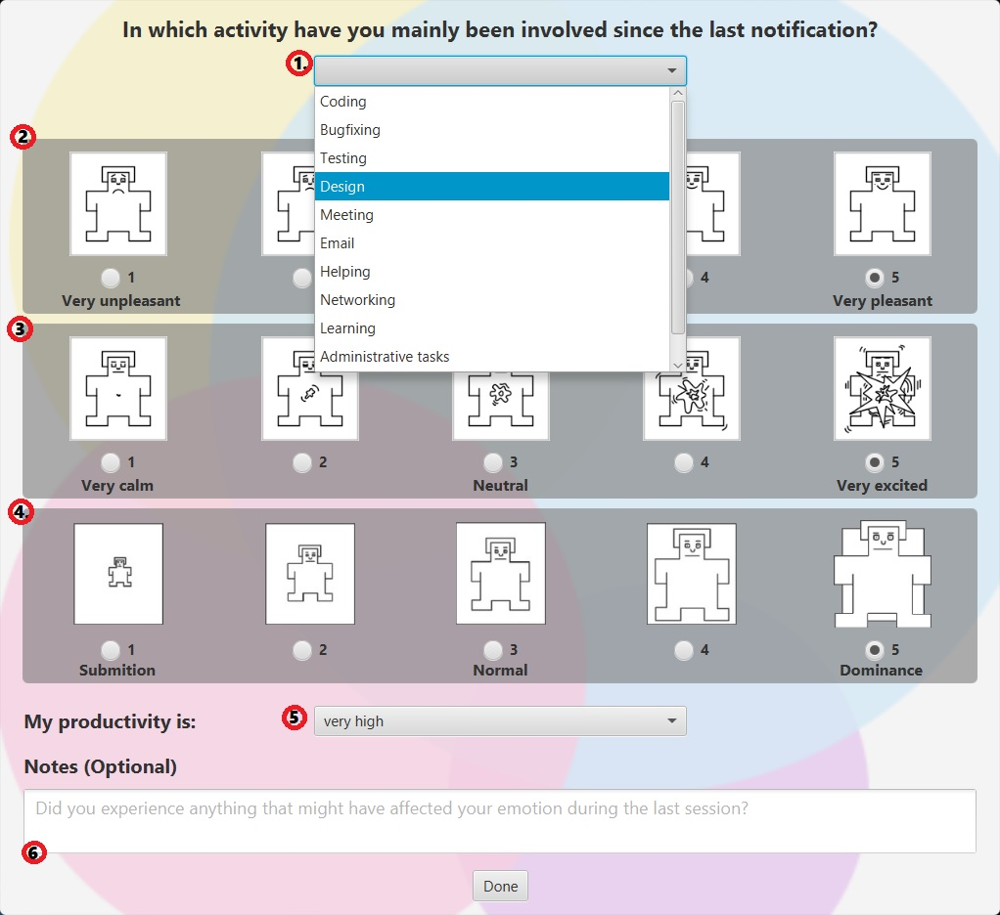
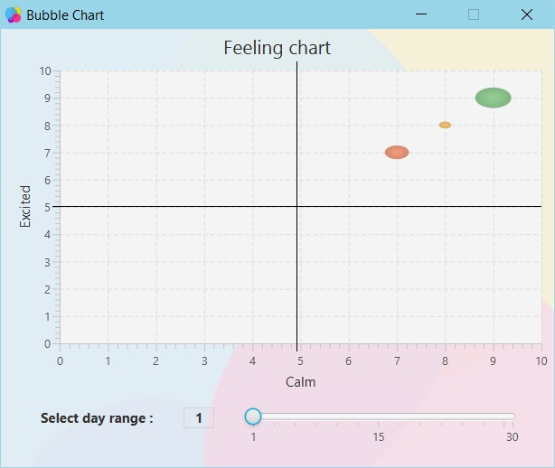

# HowAppYou

## Index

1. [**What is HowAppYou?**](#what-is-howappyou)
2. [**System Requirements**](#system-requirements)
3. [**User Guide**](#user-guide)
4. [**Credits**](#credits)

<ol>
<li>

## What is HowAppYou?

HowAppYou is an app developed to gather daily feedback on the emotional state of some subjects while they are working.
The main aim of the app is to gather enough data to use later to develop an AI.

</li>
<li>

## System Requirements

	CPU: Pentium 2 at 266 MHz or newer
	DISCK: 124 MB for JRE, 2 MB for Java Update
	RAM: 200 MB for the app
	OS: with GUI and Tray support
	
		Windows 10 (8u51 and newer)
		Windows 8.x (Desktop)
		Windows 7 SP1
		Windows Vista SP2
		Windows Server 2008 R2 SP1 (a 64 bit)
		Windows Server 2012 e 2012 R2 (a 64 bit)
	
		Mac OS X 10.8.3+, 10.9+
	
		Oracle Linux 5.5+1
		Oracle Linux 6.x (a 32 bit), 6.x (a 64 bit)2
		Oracle Linux 7.x (a 64 bit)2 (8u20 and newer)
		Red Hat Enterprise Linux 5.5+1, 6.x (a 32 bit), 6.x (a 64 bit)2
		Red Hat Enterprise Linux 7.x (a 64 bit)2 (8u20 and newer)
		Suse Linux Enterprise Server 10 SP2+, 11.x
		Suse Linux Enterprise Server 12.x (a 64 bit)2 (8u31 and newer)
		Ubuntu Linux 12.04 LTS, 13.x
		Ubuntu Linux 14.x (8u25 and newer)
		Ubuntu Linux 15.04 (8u45 and newer)
		Ubuntu Linux 15.10 (8u65 and newer)

**Java Virtual Machine [Required]**
Download JVM for your OS : [**JAVA JVM**](https://www.java.com/en/download/manual.jsp)

</li>
<li>

## User Guide

The HowAppYou software is based on the use of two main windows: the notification and the questionnaire window (HowAppYou Window).
When the application starts by double-clicking the "HowAppYou.jar" file, the application notification appears on the screen;

### - (Notification) -

**From this notification it is possible:**

1. To start the questionnaire window (HowAppYou Window) by clicking with the mouse on the "click here to open pop-up!"

2. To close the notification definitively by clicking the "dismiss" button. Once this is done you will need to call back
the questionnaire window (HowAppYou Window) using the specific command in the tray.

3. To postpone the reopening of the notification by dragging the slider cursor to the value indicated in minutes and then press "postpone"

### - (HowAppYou Window) -

**From this window it is possible:**

From this window, it is possible:
1. To select the activity, which involved you since the last notification, you can use the drop-down menu. 
2. To select your current mood, you have to click one of the circles below the first sequence of men. 
3. To select your state of excitement, you have to click on one of the circles below the second sequence of men. 
4. To select your state of dominance, you have to click on one of the circles below the third sequence of men. 
5. To select your current level of productivity from the drop-down menu. 
6. To complete the area below with a comment of your experience (Optional). 

Notes: you must complete all sections, 6. excluded, and then you can press “done” button.
It is not possible to close the form in any other way.

### - (HowAppYou Tray) -

When the application opens, an icon appears in the lower-right corner to confirm the opening of the application in the background.

From it you can select one of these options using the right mouse button:

- **Show retrospective:**
From this option it is possible to show a window displaying a bubble chart representing the registered status
during previous compilations of the Questionnaire, highlighting the intensity of them from the size of the bubble.

- **Show HowAppYou:**
It displays the program window on screen ready for a new compilation. This is useful after making a "dismiss"
of the notification.

- **Export to csv:**
It saves the data collected in the previous questionnaires in a .csv file, which can be viewed later
with any calculation tool (ES: Microsoft Excel).
It is necessary to indicate the name of the file and the location where you want to save the file.

- **Info & Credits:**
It displays a window containing the main information of the application
and references to the GitHub page of the app and its developers.

- **Quit:**
It closes the application permanently.

</li>
<li>

### - (Bubble Chart) -

With a click on “Show retrospective” this window will show up on screen.

**From the slider on the bottom-right:**

it is possible to update the chart representing the registered status during previous compilations of the Questionnaire, changing the range of days.

</li>
<li>
	
## Credits

**Developed and Designed by:**

[**0Franky**](https://github.com/0Franky)
 and [**Chrism1c**](https://github.com/Chrism1c)

</li>
</ol>
